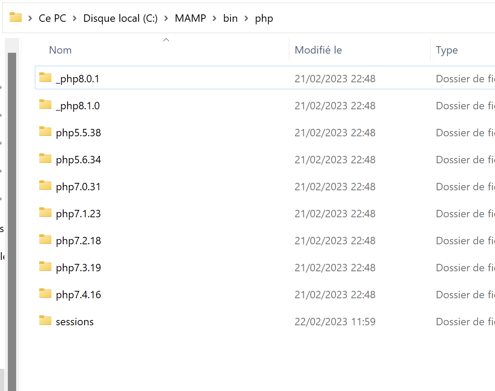
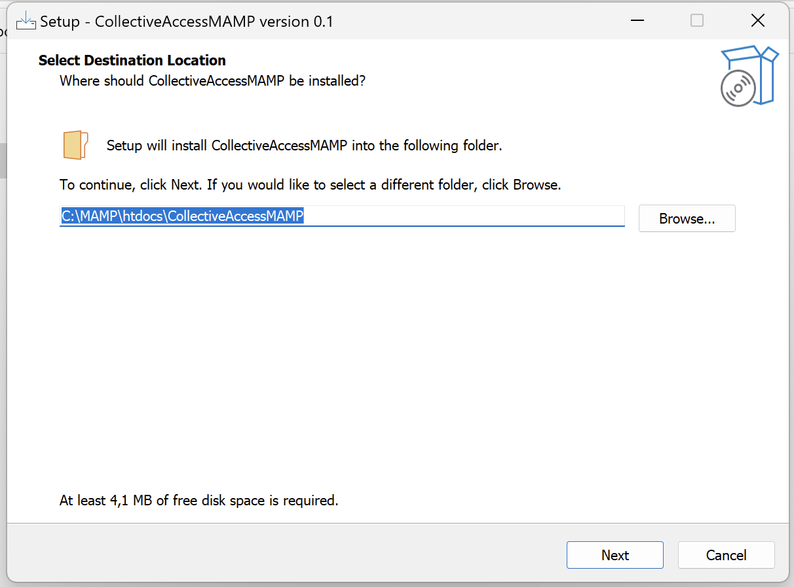

# setup_collectiveaccess_windows
Simple setup.exe auto install for Windows, requiring MAMP to be installed first

This project is maintained by <a href="https://www.ideesculture.com">IdéesCulture</a>. We do provide services on CollectiveAccess mostly in french speaking areas or institutions ; for services in USA, Canada and american country, please contact Whirl-i-Gig. For every other demands, please check collectiveaccess.org first.

## How to use the installer

### Summary

Summary in a 3 step procedure :
1. Install MAMP
2. Disable PHP 8 in MAMP
3. Launch the installer

### 1. Install MAMP

Download and install MAMP from https://www.mamp.info/en/downloads/

### 2. Disable PHP 8 in MAMP

Open the folder c:\MAMP\bin\PHP and rename :
- php8.0.1 to _php8.0.1 (to disable it)
- php8.1.0 to _php8.1.0 (to disable it)

Then STOP services and restart MAMP.

### 3. Launch the CollectiveAccessMAMP_setup.exe

----

## Developer notes
### Developer prerequisites
Prerequisites

- Install Inno Setup : https://jrsoftware.org/isinfo.php

Tested with current stable version

- Install Inno Download Plugin : https://mitrichsoftware.wordpress.com/inno-setup-tools/inno-download-plugin/

Tested with Google Drive 1.5.1 download

- MAMP : ** VERY IMPORTANT **

Open the c:\MAMP\bin\php and rename :
- php8.0.1 to _php8.0.1 (to disable it)
- php8.1.0 to _php8.1.0 (to disable it)

After THAT QUIT AND RESTART MAMP

## What is done through this installer

- last stable version of providence is downloaded and unzipped inside c:\MAMP\htdocs\providence
- a setup.php with default MAMP mysql credentials is copied inside
- a "collectiveaccess" database is created (if not already exists) inside mysql through mysql.exe command line
- a browser is run at the end of the install

## What needs to be done

There seems no way to rename directly MAMP php folders to enable PHP 7.4, still searching.

Thinking to deploy a test php file that does not redirect to install if PHP is in v8, but instead showing screen captures on how to enable PHP 7.4 in MAMP. Just in case...

## What could be done

- A pawtucket install should be done, with symlinks for medias
- the default php conf for MAMP could be edited : rising up max execution time etc. Still searching on how to edit files inside other programs.

## Why this project / disclaimer

CollectiveAccess is used in classrooms for museum curators, collection management... in France. Students in museum studies are not always able to install by themselves CollectiveAccess. This setup.exe aims to bring that gap BUT it is not to be thought of as a way to have a proper install inside a museum : backup questions are not handled, windows MAMP is not meant to be a secured Apache/MySQL/Php platform to be used as a server...

Use it to play inside CollectiveAccess, learn and discover.
